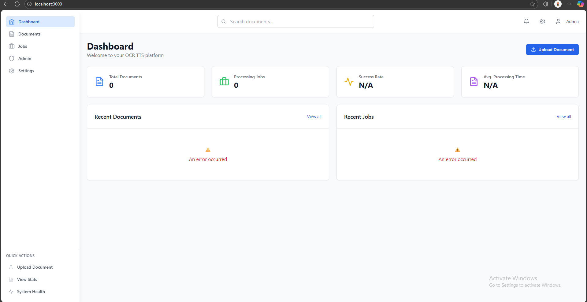

# OCR TTS Client

A modern, responsive React frontend application for the Node.js OCR TTS system. Built with React 18, TypeScript, Vite, and Tailwind CSS, this client provides an intuitive interface for document management, OCR processing, and TTS functionality.

## 🚀 Features

- **Modern React**: Built with React 18, TypeScript, and Vite for optimal performance
- **Responsive Design**: Mobile-first design with Tailwind CSS for all screen sizes
- **Document Management**: Upload, view, and manage PDF documents with real-time status updates
- **Smart Polling**: Intelligent background updates for processing status without overwhelming the server
- **Error Handling**: Comprehensive error boundaries and user-friendly error messages
- **File Upload**: Drag-and-drop file upload with progress tracking and validation
- **Real-time Updates**: Live status updates for document processing and job queues
- **Search & Filtering**: Advanced search and filtering capabilities for documents and jobs
- **Responsive Layout**: Adaptive layout that works on desktop, tablet, and mobile devices

## 📱 Screenshots

|                                                        |                                                        |
| :---------------------------------------------------: | :---------------------------------------------------: |
|   |   |
|   |   |

## 🛠️ Technology Stack

- **Frontend Framework**: React 18 with TypeScript
- **Build Tool**: Vite for fast development and optimized builds
- **Styling**: Tailwind CSS for utility-first styling
- **State Management**: Zustand for lightweight state management
- **Routing**: React Router for client-side navigation
- **HTTP Client**: Axios for API communication
- **Icons**: Lucide React for beautiful, consistent icons
- **Forms**: React Hook Form for form handling and validation

## 📁 Project Structure

```
src/
├── components/           # Reusable React components
│   ├── ui/              # Base UI components (Button, LoadingSpinner, etc.)
│   ├── layout/          # Layout components (Header, Sidebar, etc.)
│   ├── DocumentCard.tsx # Document display component
│   ├── ErrorBoundary.tsx # Error boundary for graceful error handling
│   └── FileUpload.tsx   # File upload component with drag-and-drop
├── pages/               # Page components
│   ├── HomePage.tsx     # Landing page
│   ├── DocumentsPage.tsx # Document management page
│   ├── DocumentDetailPage.tsx # Document details and processing
│   ├── JobsPage.tsx     # Job queue monitoring
│   ├── JobDetailPage.tsx # Job details and status
│   ├── SettingsPage.tsx # Application settings
│   └── NotFoundPage.tsx # 404 error page
├── services/            # API service layer
│   ├── api.ts           # Base API configuration
│   ├── documentService.ts # Document-related API calls
│   ├── jobService.ts    # Job-related API calls
│   ├── ttsService.ts    # TTS-related API calls
│   └── healthService.ts # Health check API calls
├── store/               # State management
│   ├── useDocumentStore.ts # Document state management
│   └── useJobStore.ts   # Job state management
├── hooks/               # Custom React hooks
│   └── useSmartPolling.ts # Intelligent polling for real-time updates
├── types/               # TypeScript type definitions
│   └── index.ts         # Shared types and interfaces
├── utils/               # Utility functions
│   ├── constants.ts     # Application constants
│   └── formatters.ts    # Data formatting utilities
├── main.tsx             # Application entry point
└── App.tsx              # Root application component
```

## 🚀 Getting Started

### Prerequisites
- Node.js 18.0 or higher
- npm or yarn package manager
- Backend server running (see server README)

### Installation
```bash
# Navigate to client directory
cd client

# Install dependencies
npm install

# Create environment file
cp .env.example .env
```

### Environment Configuration
Create a `.env` file in the client directory:

```env
# API Configuration
VITE_API_BASE_URL=http://localhost:3001
VITE_APP_NAME=OCR TTS Processing

# Optional: Development settings
VITE_DEBUG_MODE=true
VITE_LOG_LEVEL=info
```

### Development
```bash
# Start development server
npm run dev

# The application will be available at http://localhost:5173
```

### Building for Production
```bash
# Build the application
npm run build

# Preview the production build
npm run preview

# The built files will be in the dist/ directory
```

## 🔧 Available Scripts

- `npm run dev` - Start development server with hot reload
- `npm run build` - Build for production with optimization
- `npm run preview` - Preview production build locally
- `npm run lint` - Run ESLint for code quality
- `npm run type-check` - Run TypeScript type checking

## 🌐 API Integration

The client connects to the backend server running on the configured port (default: 3001).

### Available API Endpoints

#### Document Management
- `GET /api/documents` - List all documents with pagination
- `POST /api/documents/upload` - Upload PDF document
- `GET /api/documents/:id` - Get document details
- `GET /api/documents/:id/chunks` - Get document text chunks
- `DELETE /api/documents/:id` - Delete document
- `POST /api/documents/:id/reprocess` - Reprocess document

#### Job Processing
- `GET /api/jobs` - List processing jobs
- `GET /api/jobs/:id` - Get job details
- `POST /api/jobs/:id/cancel` - Cancel active job

#### TTS (Text-to-Speech)
- `GET /api/tts/voices` - List available TTS voices
- `POST /api/tts/synthesize` - Convert text to speech
- `GET /api/tts/audio/:id` - Get generated audio file

#### System
- `GET /api/health` - Server health check

## 🎨 UI Components

### Core Components

#### DocumentCard
Displays document information in a card format with actions:
- Document status indicator
- File information (name, size, upload date)
- Action buttons (view, delete, reprocess)
- Processing progress for active jobs

#### FileUpload
Advanced file upload component with:
- Drag-and-drop functionality
- File type validation (PDF only)
- Size limit checking
- Upload progress tracking
- Error handling and user feedback

#### ErrorBoundary
Graceful error handling component that:
- Catches JavaScript errors in child components
- Displays user-friendly error messages
- Provides recovery options
- Logs errors for debugging

### Layout Components

#### Header
Application header with:
- Navigation menu
- User account information
- Application branding
- Responsive mobile menu

#### Sidebar
Navigation sidebar with:
- Main navigation links
- Document categories
- Quick actions
- Collapsible on mobile

## 🔄 State Management

### Zustand Stores

#### Document Store (`useDocumentStore`)
Manages document-related state:
- Document list with pagination
- Search and filtering
- Document operations (upload, delete, reprocess)
- Loading states and error handling

#### Job Store (`useJobStore`)
Manages job processing state:
- Job queue monitoring
- Job status updates
- Processing progress
- Real-time updates

### Smart Polling

The application uses intelligent polling to provide real-time updates without overwhelming the server:
- Adaptive polling intervals based on job status
- Exponential backoff for failed requests
- Automatic cleanup when components unmount
- Configurable polling strategies

## 📱 Responsive Design

The application is built with a mobile-first approach:
- **Mobile**: Single-column layout with collapsible navigation
- **Tablet**: Two-column layout with sidebar navigation
- **Desktop**: Full layout with persistent sidebar and multi-column content

### Breakpoints
- **sm**: 640px and up
- **md**: 768px and up
- **lg**: 1024px and up
- **xl**: 1280px and up

## 🎯 Key Features

### Document Management
- **Upload**: Drag-and-drop PDF upload with validation
- **View**: Document details with processing status
- **Search**: Full-text search across document metadata
- **Filter**: Filter by status, date, and file type
- **Actions**: Delete, reprocess, and download documents

### Job Monitoring
- **Queue View**: Real-time job queue monitoring
- **Status Tracking**: Live updates on processing progress
- **Job Details**: Comprehensive job information and logs
- **Cancellation**: Cancel active processing jobs

### User Experience
- **Loading States**: Smooth loading indicators throughout the app
- **Error Handling**: User-friendly error messages and recovery options
- **Notifications**: Toast notifications for user actions
- **Keyboard Navigation**: Full keyboard accessibility support

## 🔧 Configuration

### Tailwind CSS
The application uses Tailwind CSS with custom configuration:
- Custom color palette matching the brand
- Responsive breakpoints for mobile-first design
- Custom component classes for consistent styling
- Dark mode support (planned)

### Vite Configuration
Vite is configured for optimal development and production:
- Fast hot module replacement
- TypeScript support out of the box
- Optimized builds with code splitting
- Environment variable handling

## 🧪 Testing

```bash
# Run unit tests
npm test

# Run tests in watch mode
npm run test:watch

# Run tests with coverage
npm run test:coverage

# Run specific test files
npm test -- --testNamePattern="DocumentCard"
```

## 🚨 Troubleshooting

### Common Issues

1. **Build Errors**
   ```bash
   # Clear node_modules and reinstall
   rm -rf node_modules package-lock.json
   npm install
   ```

2. **API Connection Issues**
   - Verify `VITE_API_BASE_URL` in `.env`
   - Ensure backend server is running
   - Check CORS configuration on server

3. **TypeScript Errors**
   ```bash
   # Run type checking
   npm run type-check
   
   # Check for missing types
   npm install @types/react @types/react-dom
   ```

4. **Styling Issues**
   - Verify Tailwind CSS is properly configured
   - Check for CSS conflicts
   - Ensure PostCSS is configured correctly

### Development Tips

- Use React DevTools for component debugging
- Check browser console for API errors
- Use Network tab to monitor API requests
- Verify environment variables are loaded correctly

## 🚀 Performance Optimization

### Code Splitting
- Route-based code splitting for pages
- Component lazy loading for heavy components
- Dynamic imports for optional features

### Bundle Optimization
- Tree shaking for unused code removal
- Minification and compression
- Asset optimization and caching

### Runtime Performance
- Memoized components to prevent unnecessary re-renders
- Efficient state updates with Zustand
- Optimized re-render cycles

## 🔮 Future Enhancements

- [ ] Dark mode support
- [ ] Advanced document preview
- [ ] Real-time WebSocket updates
- [ ] Offline support with service workers
- [ ] Advanced search with filters
- [ ] Document sharing and collaboration
- [ ] Mobile app (React Native)
- [ ] PWA capabilities
- [ ] Advanced analytics and reporting
- [ ] Multi-language support

## 🤝 Contributing

1. Fork the repository
2. Create a feature branch (`git checkout -b feature/amazing-feature`)
3. Make your changes with proper TypeScript types
4. Add tests for new functionality
5. Ensure all tests pass and linting is clean
6. Submit a pull request with detailed description

## 📄 License

This project is licensed under the MIT License - see the [LICENSE](../LICENSE) file for details.

## 🙏 Acknowledgments

- **React Team** - For the amazing frontend framework
- **Vite Team** - For the fast build tool
- **Tailwind CSS** - For the utility-first CSS framework
- **Zustand** - For lightweight state management
- **Lucide** - For beautiful, consistent icons

---

**Happy Document Processing! 📄✨**